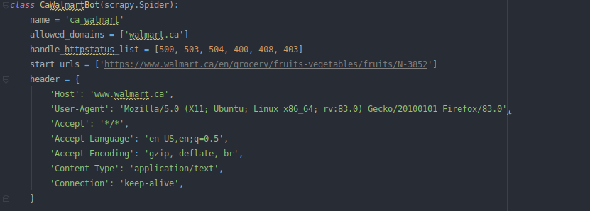

# Cornershop's backend integrations test

## Summary
- **Case 1**: Scraping a product department at Walmart Canada's website
- **Case 2**: Processing CSV files to extract clean information

## Prerequisites
- Delete Database db.sqlite in `integrations/richart_wholesale_club/db.sqlite` and `scrapers/spiders/db.sqlite`
- Run script database_setup
- Copy db.sqlite in the paths `integrations/richart_wholesale_club/db.sqlite` and `scrapers/spiders/db.sqlite`

## Process

### Case 1
For this case it is only necessary to run the python file: `ingestion.py`

It will be saved in the database hosted on the path: `integrations/richart_wholesale_club/db.sqlite`

### Case 2
For this case it is only necessary to run the following command:
```shell script
  scrapy crawl ca_walmart
```

It will be saved in the database hosted on the path: `scrapers/spiders/db.sqlite`

---
**NOTE**

If the following error appears :


It is a Bot Protection Page with captcha v2.

For resolving, follow with the following steps:
1. Enter any link that says Redirecting (307), 
for example: `https://www.walmart.ca/blocked?url=L2VuL2lwL2FwcGxlLW1jaW50b3NoLXlvdXItZnJlc2gtbWFya2V0LzYwMDAxOTczNDM1NDI=&uuid=9be49990-5f04-11eb-aafd-23912374fcaf&vid=&g=a'`
2. You will get a page similar to this:

Solve the captcha v2
3. At this time, walmart has already saved your browser and you will be able to make inquiries to your product pages, in about 5 to 10 minutes you will be able to make inquiries without problems.
  
   Check if the browser is the same as the User-Agent variable in the header that is used for product links::
   
   
   Mozilla has been used by default, so it is recommended that catpcha resolve it in mozilla.

---

## Improvements for the future
- The issue could be solved with captcha v2 with selenium
- Right now, there are two SQlite databases, but it is recommended that both scraper and ingest data connect to a common database on a server.

